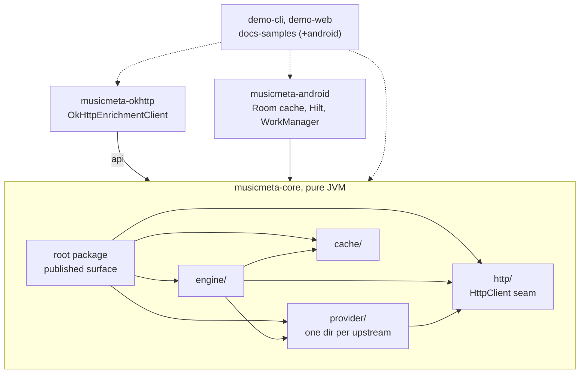
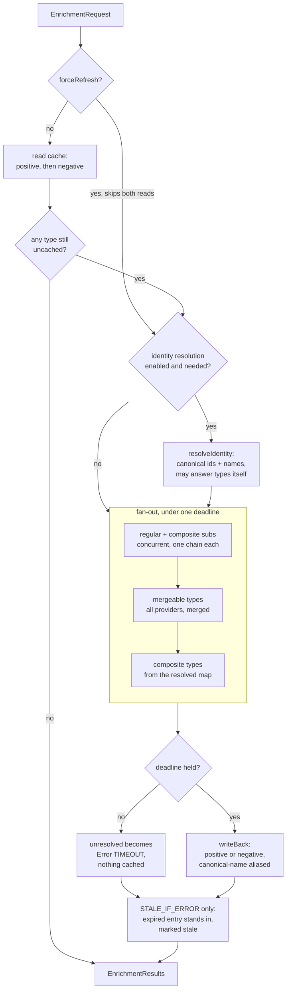

# ARCHITECTURE

Why the modules are split where they are, what flows between them, and what a change costs. This is
the map. The pipeline's step-by-step behaviour is `docs/how-it-works.md`, each provider's data
semantics is `docs/providers.md`, and what a green check run proves is `VERIFICATION.md`.

## The bar designs are judged by

musicmeta delivers music metadata from independent upstreams that change without notice. Every
structural choice below is judged by one question: **what does it cost the eleventh provider?** A
seam that makes the next provider cheaper to add, test, and trust earns its complexity; one that
only serves the providers already here does not.

## Module map
```
musicmeta-core        pure JVM: the engine, the provider implementations, the contracts
├── engine/           pipeline: identity, fan-out, gating, merging, synthesis — internal but for
│                     ResultMerger and CompositeSynthesizer, the two extension-point interfaces
├── provider/<name>/  one dir per upstream: *Api, *Models, *Mapper (internal) + at least one
│                     public *Provider — deezer ships a second for similar albums
├── cache/            CacheMode and the in-memory EnrichmentCache
├── http/             the HttpClient seam, rate limiter, budgeted retry, circuit breaker
└── (root package)    the published surface: request/result/profile types, EnrichmentEngine.Builder

musicmeta-okhttp      one class: OkHttpEnrichmentClient, adapting OkHttp to core's HttpClient
musicmeta-android     Room-backed EnrichmentCache (schema + migrations), Hilt wiring, WorkManager
demo-cli, demo-web,   separate composite builds consuming the published shape the way an external
docs-samples[-android]  consumer does — the in-tree stand-ins for consumers we cannot see
```


The edges that matter are the ones that are absent: **core depends on neither adapter.** It names a
wire library nowhere and an Android artifact nowhere, which is what lets a server or desktop
consumer take the engine without either.

## Why the boundaries sit where they do

**core is dependency-minimal JVM** — coroutines, `org.json`, and kotlinx-serialization, nothing
else. Serialization is declared `api(...)`, so it is on a consumer's compile classpath and its
version is part of the published contract; the other two are `implementation`.

**`http/`'s `HttpClient` interface is the seam that keeps it that way.** Core owns transport
*semantics* — what is transient, how a retry budget composes with the enrich deadline, when a
breaker opens — without owning a wire library. Those semantics are policy, not plumbing, and
they are why the interface is core's rather than an adapter's (`docs/pitfalls.md` §11).

**musicmeta-okhttp exists so core does not force a client.** It is deliberately one adapter class,
and it delegates to core's `BudgetedTransientRetry` rather than installing a retrying interceptor —
an interceptor cannot see the enrich deadline, and retry that happens where core cannot count it is
retry no budget bounds. It declares core as `api`, so taking the adapter takes the library.

**musicmeta-android is persistence, DI, and scheduling.** The Room cache implements the same
`EnrichmentCache` contract the in-memory one does, and both are proven by one shared
`EnrichmentCacheContract` in core's `testFixtures` rather than by parallel suites. `EnrichmentWorker`
holds real orchestration — batching, cancellation, progress — but it drives the engine from outside;
nothing here forks engine *behaviour* by platform, and anything that would is a defect.

**Demos and doc-samples are consumer canaries, not examples.** They compile against the published
shape in separate builds, so a break that `apiCheck`'s erased JVM descriptors cannot see still fails
a build that consumes the library from outside (`docs/pitfalls.md` §1).

## One `enrich()` call


Every result is gated as it is produced — `filterByConfidence`, then `demoteUnanswered` — inside
whichever stage produced it, rather than in one pass over the finished set. Confidence runs first
because it scores the identification, not the payload (`docs/pitfalls.md` §8): a perfect identity
match can still carry a payload that answers nothing.

Three things this ordering is load-bearing about. **The cache is read before identity resolution**,
so a fully cached call never touches an upstream — unless `forceRefresh` skips both reads, which is
the only way to make one. **Composites are last because they read a map the earlier stages fill** —
they depend on resolved types, so the stages are ordered, not merely parallel. And **a timed-out run
returns what it has but persists none of it**, because the deadline can fire part-way through a step
that rewrites entries, so what survives is a mix of finished and unfinished work.

Two engine-level invariants constrain every provider rather than any one of them, which is what
makes them architectural: **confidence and provenance may understate the evidence, never overstate
it**, and **an absence must never be reported where a failure occurred**. Both are one-directional
on purpose, because consumers branch on the distinction. What each cost to learn is
`docs/pitfalls.md` §4 and §8.

## What the eleventh provider costs

A new provider is a directory under `provider/`, laid out as `CLAUDE.md` prescribes. What that buys
is the point here: it inherits, rather than re-implements,

- transport resilience — rate limiter, budgeted retry, circuit breaker — from `http/`, with one
  breaker per provider id shared across every chain it appears in;
- gating, merging, synthesis, caching, and provenance stamping from `engine/`;
- the shared contract suites and the `scripts/checks/` gates, which apply to it by construction
  rather than by anyone remembering;
- registration through `Builder.addProvider`, which rejects a duplicate id and a reserved one —
  including any id ending `_merger`, the suffix mergers stamp on their own output. Synthesizers
  stamp `_synthesizer`, which is **not** reserved.

What it must supply is the judgement the engine cannot: parsing that survives the upstream's actual
payloads, search acceptance that checks artist and title rather than trusting hit 0
(`docs/pitfalls.md` §7), and a `confidence` that reflects the evidence.

The cost that is not abstracted away is fixtures. A provider test asserts against a fixture copied
from a real response, because that is what pins a field name against upstream drift
(`docs/pitfalls.md` §3). Nothing mechanises this — it is a convention review enforces, and a pool
whose chain back to a live capture is unverified says so in its own `scenario.md`.

## Where a change lands

| Changing | Reaches | Watch for |
|---|---|---|
| The published surface (root-package types, `Builder`) | every consumer, `api/*.api`, `CHANGELOG.md` | erased descriptors hide suspend and nullability breaks — read the `.kt`, not the dump (§1) |
| Engine behaviour (`engine/`) | every provider at once | the two one-directional invariants above |
| One provider (`provider/<name>/`) | its own directory | its fixtures must predate the change, or they prove only that the code agrees with itself |
| Transport policy (`http/`) | every call every provider makes | budgets compose with the enrich deadline (§11); breaker state is shared per provider id, and a provider's own memo is state no consumer can flush (§12) |
| Android persistence | devices that already installed a schema | a migration cannot be undone by reverting the code that shipped it |
