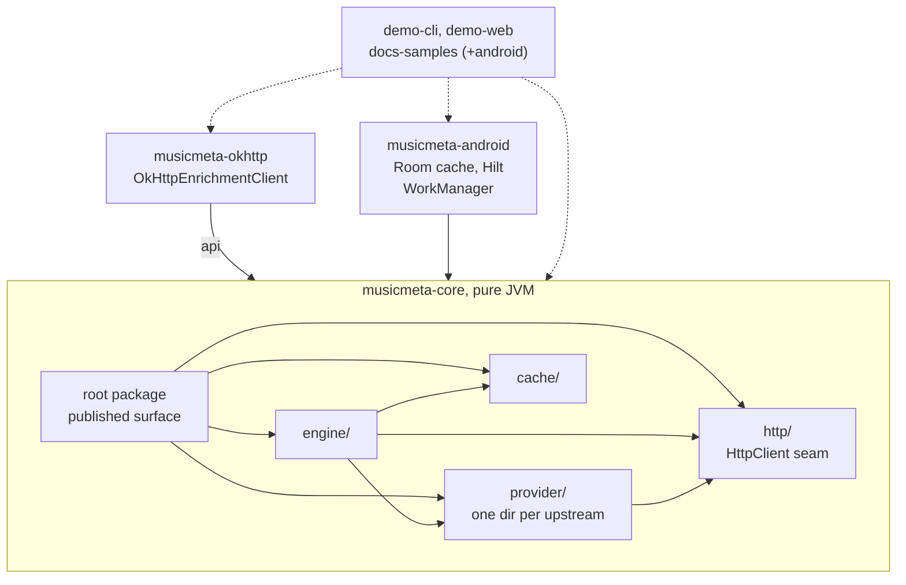
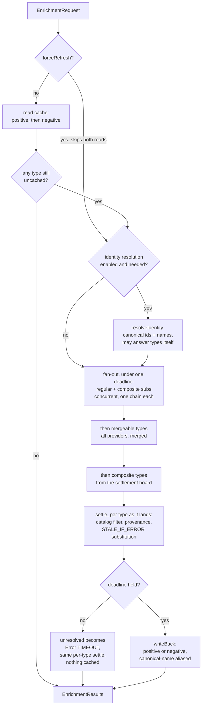
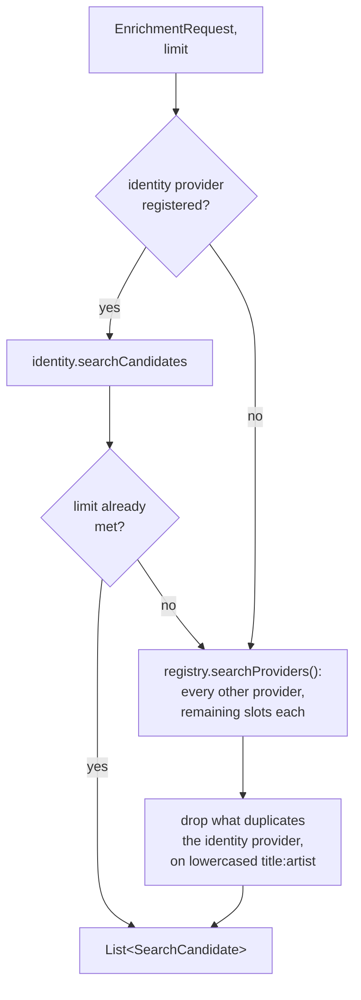

# ARCHITECTURE

Why the modules are split where they are, what flows between them, and what a change costs. This is
the map. The pipeline's step-by-step behaviour is `docs/how-it-works.md`, each provider's data
semantics is `docs/providers.md`, and what a green check run proves is `VERIFICATION.md`.

## The bar designs are judged by

musicmeta delivers music metadata from independent upstreams that change without notice. Every
structural choice below is judged by one question: **what does it cost the eleventh provider?** A
seam that makes the next provider cheaper to add, test, and trust earns its complexity; one that
only serves the providers already here does not.

## Module map
```
musicmeta-core        pure JVM: the engine, the provider implementations, the contracts
├── engine/           pipeline: identity, fan-out, gating, merging, synthesis — internal but for
│                     ResultMerger and CompositeSynthesizer, the two extension-point interfaces
├── provider/<name>/  one dir per upstream: *Api, *Models, *Mapper (internal) + at least one
│                     public *Provider — deezer ships a second for similar albums
├── cache/            CacheMode and the in-memory EnrichmentCache
├── http/             the HttpClient seam, rate limiter, budgeted retry, circuit breaker
└── (root package)    the published surface: request/result/profile types, EnrichmentEngine.Builder

musicmeta-okhttp      one class: OkHttpEnrichmentClient, adapting OkHttp to core's HttpClient
musicmeta-android     Room-backed EnrichmentCache (schema + migrations), Hilt wiring, WorkManager
demo-cli, demo-web,   separate composite builds consuming the published shape the way an external
docs-samples[-android]  consumer does — the in-tree stand-ins for consumers we cannot see
```


The edges that matter are the ones that are absent: **core depends on neither adapter.** It names a
wire library nowhere and an Android artifact nowhere, which is what lets a server or desktop
consumer take the engine without either.

## Why the boundaries sit where they do

**core is dependency-minimal JVM** — coroutines, `org.json`, and kotlinx-serialization, nothing
else. Serialization is declared `api(...)`, so it is on a consumer's compile classpath and its
version is part of the published contract; the other two are `implementation`.
A fourth entry reaches every consumer transitively and cannot be withdrawn without a break, so the
argument for each one is written beside it in `musicmeta-core/build.gradle.kts`. The list itself is
gated: the published POM's dependencies are baselined in `musicmeta-core/api/` and diffed on every
run, so an addition or a version move fails rather than merging quietly. Whether an entry's argument
is a good one is not gated, and stays with review.

**`http/`'s `HttpClient` interface is the seam that keeps it that way.** Core owns transport
*semantics* — what is transient, how a retry budget composes with the enrich deadline, when a
breaker opens — without owning a wire library. Those semantics are policy, not plumbing, and
they are why the interface is core's rather than an adapter's (`docs/pitfalls.md` §11).

**musicmeta-okhttp exists so core does not force a client.** It is deliberately one adapter class,
and it delegates to core's `BudgetedTransientRetry` rather than installing a retrying interceptor —
an interceptor cannot see the enrich deadline, and retry that happens where core cannot count it is
retry no budget bounds. It declares core as `api`, so taking the adapter takes the library.

**musicmeta-android is persistence, DI, and scheduling.** The Room cache implements the same
`EnrichmentCache` contract the in-memory one does, and both are proven by one shared
`EnrichmentCacheContract` in core's `testFixtures` rather than by parallel suites. `EnrichmentWorker`
holds real orchestration — batching, cancellation, progress — but it drives the engine from outside;
nothing here forks engine *behaviour* by platform, and anything that would is a defect.

**Demos and doc-samples are consumer canaries, not examples.** They compile against the published
shape in separate builds, so a break that `apiCheck`'s erased JVM descriptors cannot see still fails
a build that consumes the library from outside (`docs/pitfalls.md` §1).

## Two entry points, two paths

`EnrichmentEngine` has one call that resolves metadata and one that resolves *candidates*:
`enrich()` below, and `search()`, which a "did you mean?" prompt or a search-ahead UI calls
directly — its usage is `docs/guides/identity-resolution.md`. The two share providers but nothing
else; `search()`'s absent edges are the point of its own section, after `enrich()`'s.

## One `enrich()` call


Every result is gated as it is produced — `filterByConfidence`, then `demoteUnanswered`, then catalog
filtering, provenance stamping and `STALE_IF_ERROR` substitution — inside whichever stage produced
it, rather than in one pass over the finished set. Confidence runs first because it scores the
identification, not the payload (`docs/pitfalls.md` §8): a perfect identity match can still carry a
payload that answers nothing.

Three things this ordering is load-bearing about. **The cache is read before identity resolution**,
so a fully cached call never touches an upstream — unless `forceRefresh` skips both reads, which is
the only way to make one. **Composites are last because they read the settlement board the earlier
stages have already written into** — they depend on resolved types, so the stages are ordered, not
merely parallel. And **a timed-out run returns what it has but persists none of it**, because the
deadline can fire part-way through a step that rewrites entries, so what survives is a mix of
finished and unfinished work.

Two engine-level invariants constrain every provider rather than any one of them, which is what
makes them architectural: **confidence and provenance may understate the evidence, never overstate
it**, and **an absence must never be reported where a failure occurred**. Both are one-directional
on purpose, because consumers branch on the distinction. What each cost to learn is
`docs/pitfalls.md` §4 and §8.

## `enrichProgressive()` and the engine's own lifecycle

`enrich()` above is `enrichProgressive(...).last()` over one shared resolution path — nothing in the
diagram above changes, but each type's settle step (catalog filter, provenance, stale-cache
substitution) also emits an intermediate `EnrichmentResults` snapshot the moment that type lands,
carrying every type settled so far. `enrich()`'s callers get only the terminal snapshot; a caller of
`enrichProgressive()` sees every one.

**One path, not two, is the load-bearing constraint here** — the reason a streaming API was not
cheap to add. A streamed second implementation of the same pipeline was built and measured against
the suite: it diverged from `enrich()` on error classification, silently, in composite synthesis and
identity failure. What a caller would have got is a composite type absent from the results
altogether where `enrich()` returns a typed `Error`. Nothing about a streaming surface forces that
divergence — but nothing catches it either, so the cost of the feature is the shared seam
underneath it, not the method on the interface.

This makes the engine stateful in a way it was not before: `DefaultEnrichmentEngine` owns a
`CoroutineScope` (`detachedScope`, on `Dispatchers.Default`) that a fan-out runs as a child of, not
as a child of the caller's own coroutine. Cancelling the caller — a collector leaving composition,
`take(1)`, the calling coroutine itself being cancelled — detaches from that fan-out rather than
aborting it: the run keeps going, unattended, until it settles or times out, and its cache write-back
still happens. This is complete-and-cache, not abort-and-forfeit, and it is the reason the interface
gained `close()`: releasing `detachedScope` (and abandoning, never waiting for, whatever is still
running on it) is the one thing nothing else does for you. A consumer that never calls `close()`
costs at most one shared dispatcher and whatever distinct request/types/`forceRefresh` runs are
genuinely in flight — bounded, but real, and owned by the consumer holding the engine, not by this
library. Two calls coalesce onto one in-flight run only when their request, their requested types
and their `forceRefresh` all match; differing in any of the three starts a second run, even when the
*uncached* type sets happen to coincide. The key describes the request, not a resolved entity, so
two spellings of one artist — an MBID-bearing request and a name-only one — start two runs. That
under-coalesces rather than over-coalesces, which is the safe direction: it never merges two
genuinely different entities.

## One `search()` call


`search()` installs the same `EnrichDeadline` as `enrich()`, sized from the same
`enrichTimeoutMs` — despite the name, a budget a retry consults rather than a hard cut-off. It is
there because its providers make the same typed HTTP calls, and an unbudgeted 429 there would
retry against the transport's own 120s ceiling instead of a bound the caller already chose. That
is the only machinery the two calls share. `enrich()` also wraps itself in `withTimeoutOrNull`
and returns partial results when that fires; `search()` does not, so it never truncates and can
outlast `enrichTimeoutMs` against an upstream that is merely slow. A caller who needs search
bounded imposes the bound itself.

Everything `enrich()` does between a request and a result, `search()` skips: no cache read or
write, no identity resolution as `enrich()` runs it (the identity provider is asked directly, as
one candidate source among others, not to backfill the request), no merging, no gating. The
identity provider goes first and the rest fill in only what it left short of `limit`, so a
well-known entity costs one call, not one per provider. A provider that throws is logged and
treated as an empty contribution, because one upstream's outage should shrink the candidate list,
not fail the search. `ensureActive()` is what stops that from swallowing a cancellation: the
caller cancelling, or our own deadline firing, must still fail the call rather than read as a
provider that returned nothing.

The missing edges are why this call exists as a separate path rather than a thin `enrich()`
wrapper. Skipping the cache is what lets a search-ahead UI call this per keystroke without
writing an entry, and later expiring, for every character the user typed. Skipping gating is the
corresponding cost: a `SearchCandidate` carries a `matchScore`, not the confidence and provenance
`enrich()` stamps on a `Success`, so it is a pick-list entry, not an enriched result — a caller
that treats one as the other is treating an unvetted guess as gated data.

**`matchScore` is one scale, and the list is still not sorted by it.** Every candidate arrives
on 0.0–1.0, but that only makes the numbers the same shape, not the same claim: the identity
provider divides down an upstream relevance score, while a supplemental provider that has no such
number returns a flat constant standing in for one. The returned list is the identity provider's
candidates followed by whatever the others uniquely added — provenance order, not merit order. A
UI that re-sorts on `matchScore` is ranking a relevance score against a constant. This is the shape of every unmerged, ungated result the engine hands back: comparable
within a provider, not across them.

## What the eleventh provider costs

A new provider is a directory under `provider/`, laid out as `CLAUDE.md` prescribes. What that buys
is the point here: it inherits, rather than re-implements,

- transport resilience — rate limiter, budgeted retry, circuit breaker — from `http/`, with one
  breaker per provider id shared across every chain it appears in;
- gating, merging, synthesis, caching, and provenance stamping from `engine/`;
- the shared contract suites and the `scripts/checks/` gates, which apply to it by construction
  rather than by anyone remembering;
- registration through `Builder.addProvider`, which rejects a duplicate id and a reserved one —
  including any id ending `_merger`, the suffix mergers stamp on their own output. Synthesizers
  stamp `_synthesizer`, which is **not** reserved.

A published shape the eleventh provider must *change* rather than *extend* is the wrong shape:
`EnrichmentProvider`, `IdentifierNamespace`, `LookupProvenance`, `ProviderPolicies` and `ApiKey`
each grow by one appended member, and nothing in the root package grows by one field per provider.

What it must supply is the judgement the engine cannot: parsing that survives the upstream's actual
payloads, search acceptance that checks artist and title rather than trusting hit 0
(`docs/pitfalls.md` §7), and a `confidence` that reflects the evidence.

The cost that is not abstracted away is fixtures. A provider test asserts against a fixture copied
from a real response, because that is what pins a field name against upstream drift
(`docs/pitfalls.md` §3) — the one part of a new provider that no seam above makes cheaper.

## Where a change lands

| Changing | Reaches | Watch for |
|---|---|---|
| The published surface (root-package types, `Builder`) | every consumer, `api/*.api`, `CHANGELOG.md` | erased descriptors hide suspend and nullability breaks — read the `.kt`, not the dump (§1) |
| Engine behaviour (`engine/`) | every provider at once | the two one-directional invariants above |
| One provider (`provider/<name>/`) | its own directory | its fixtures must predate the change, or they prove only that the code agrees with itself |
| Transport policy (`http/`) | every call every provider makes | budgets compose with the enrich deadline (§11); breaker state is shared per provider id, and a provider's own memo is state no consumer can flush (§12) |
| Android persistence | devices that already installed a schema | a migration cannot be undone by reverting the code that shipped it |
