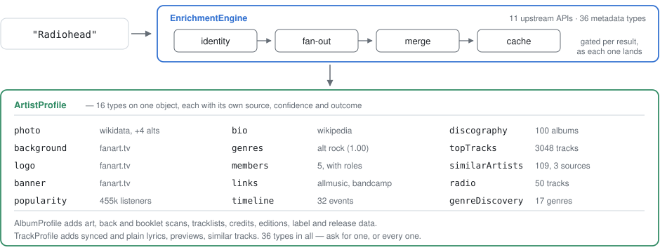
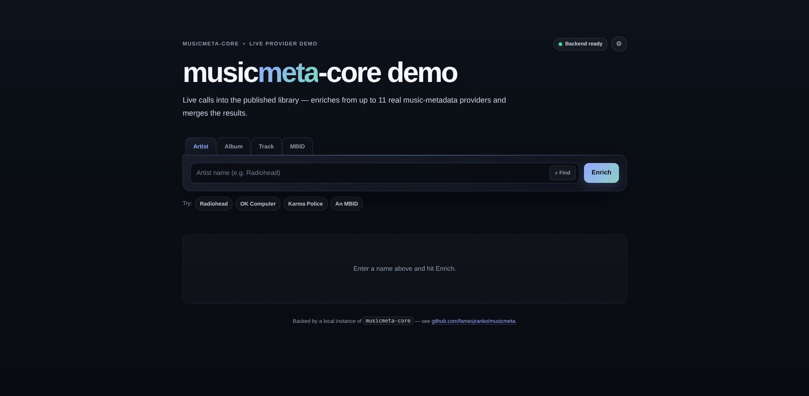

<div align="center">
         
[](https://central.sonatype.com/artifact/io.github.famesjranko/musicmeta-core)
[](https://jitpack.io/#famesjranko/musicmeta)
[](https://www.apache.org/licenses/LICENSE-2.0)
[](https://kotlinlang.org)
[](https://musicmeta-demo-354377080055.us-central1.run.app)

</div>

A Kotlin library for Android and JVM music apps: 11 public music APIs behind one engine, 8 of them usable without API keys. Ask for as much or as little as you need: all 36 enrichment types, a single artist photo, or just lyrics. The engine handles identity resolution, multi-provider merging, confidence scoring, rate limiting and caching. Providers set their own terms on commercial use, licensing and attribution, so see [docs/providers.md](docs/providers.md#terms-licences-attribution) before shipping.

**[Try the live demo](https://musicmeta-demo-354377080055.us-central1.run.app)** to see the engine enrich a real search across every provider, or run it yourself; see [demo-web](demo-web/README.md).

## What it does

<picture>
  <source media="(prefers-color-scheme: dark)" srcset="docs/assets/what-it-does-dark.svg">
  
</picture>

MusicBrainz resolves the MBID first, so every lookup after it is an identifier lookup rather than a
name search. Rate limiting, circuit breaking, confidence scoring and caching are built in. Every type
resolves on its own, so a provider that fails costs you that type and nothing else.

The values above come from one real call with all four optional keys set, captured 2026-08-18;
upstream data moves, so treat them as a shape rather than a guarantee. Keyless it answers 12 of
those 15 types, with fewer image alternates, 20 similar artists rather than 31, and genre confidence
at 0.70.

## Quick start

Coordinates are in [Installation](#installation).

```kotlin
val engine = EnrichmentEngine.Builder()
    .withDefaultProviders()
    .build()

// Artist profile: photo, bio, genres, members, discography, similar artists, ...
// artistProfile() is a suspend fun — call it from a coroutine or runBlocking { }
val profile = engine.artistProfile("Radiohead")

println(profile.photo?.url)
println(profile.bio?.text)
profile.genres.forEach { println("${it.name} (${it.confidence})") }
profile.discography.forEach { println("${it.title} (${it.year})") }
```

`albumProfile()` and `trackProfile()` are the same shape. Each picks sensible default types for its
entity kind; pass `types` to request less and skip the API calls you do not need:

```kotlin
val minimal = engine.artistProfile("Radiohead", types = setOf(
    EnrichmentType.GENRE, EnrichmentType.ARTIST_PHOTO,
))
```

The engine resolves every type independently: a provider that fails, rate limits or times out
yields a typed result on that one type, and the rest of the profile is unaffected. `profile.results` carries the per-type outcome when you need to tell "no data" from
"could not fetch".

**Going further.** Progressive streaming with `enrichProgressive()`, pre-resolved identifiers, named
accessors, the raw result map, and the failure-isolation guarantees are in the
[developer guides](docs/guides/README.md).

## Search and disambiguation

`engine.search()` returns `SearchCandidate` matches without running the enrichment pipeline or
touching the cache. Use it for a search-ahead UI where the user picks an entity before you fetch
its metadata. It carries no deadline of its own, so wrap it in `withTimeout` where a slow upstream
must not hang the UI.

```kotlin
val candidates = engine.search(EnrichmentRequest.forArtist("pink floyd"), limit = 5)
val chosen = candidates.first() // whichever one the user picked

// Enriching from the pick carries the identifiers the search already resolved.
// A candidate with a MusicBrainz id pins the entity outright; candidates from
// the other providers carry none, so those still resolve by name.
val profile = engine.artistProfile(chosen)
```

Show the list in the order it arrives, and **do not sort it by `score`**, because that number is each
provider's own, not comparable across them, so sorting on it ranks unlike scales.

The same candidates surface unprompted when a name is ambiguous: an enriched profile carries
them, so `engine.artistProfile("pink floid").suggestions`, or `results.identity.suggestions` via
`enrich()`, holds the near-miss matches. Pick one and re-enrich with it, same as above. See
[identity resolution](docs/guides/identity-resolution.md) for the full "did you mean?" flow.

## Providers

| Provider | Data | API Key |
|----------|------|---------|
| MusicBrainz | Identity (MBID), genre, label, dates, members, discography, tracks, links, credits, editions | No |
| Cover Art Archive | Album art front/back/booklet (multi-size), CD art | No |
| Wikidata | Artist photo, country of origin, artist links | No |
| Wikipedia | Artist biography, album descriptions, supplemental photos | No |
| LRCLIB | Synced + plain lyrics, track metadata | No |
| Deezer | Artist photos, album art, discography, tracklists, album metadata, similar artists/tracks, artist radio, top tracks, similar albums, track previews | No |
| iTunes | Album art, tracklists, discography, album metadata | No |
| ListenBrainz | Popularity, listen counts, discography, top tracks, radio discovery (requires a token) | Optional |
| Last.fm | Genres, similar artists/tracks, bios, popularity, album metadata | Yes |
| Fanart.tv | Artist photos/backgrounds/logos/banners, CD art, album art | Yes |
| Discogs | Labels, members, credits, editions, artwork, album metadata, community ratings | Yes |

8 of 11 providers work without API keys. `withDefaultProviders()` registers a key-requiring provider
only when you supply its key, so the types it would have served simply fall through to the providers
you do have.

**Getting API keys (all free):**
- Last.fm: https://www.last.fm/api/account/create
- Fanart.tv: https://fanart.tv/get-an-api-key/
- Discogs: https://www.discogs.com/settings/developers -> "Generate new token"

Pass keys via `ApiKeyConfig`:

```kotlin
val engine = EnrichmentEngine.Builder()
    .apiKeys(ApiKeyConfig.of(
        ApiKey.LASTFM_API_KEY to "...",
        ApiKey.FANARTTV_PROJECT_KEY to "...",
        ApiKey.DISCOGS_PERSONAL_TOKEN to "...",
        ApiKey.LISTENBRAINZ_USER_TOKEN to "...",  // Optional, unlocks ARTIST_RADIO_DISCOVERY
    ))
    .withDefaultProviders()
    .build()
```

## Enrichment types (36)

| Category | Types | Multi-provider |
|----------|-------|----------------|
| **Artwork** | ALBUM_ART, ALBUM_ART_BACK, ALBUM_BOOKLET, ARTIST_PHOTO, ARTIST_BACKGROUND, ARTIST_LOGO, ARTIST_BANNER, CD_ART | ALBUM_ART merged (5), ARTIST_PHOTO merged (5: Wikidata, Fanart.tv, Deezer, Discogs, Wikipedia), CD_ART (2) |
| **Metadata** | GENRE, LABEL, RELEASE_DATE, RELEASE_TYPE, COUNTRY, BAND_MEMBERS, ARTIST_DISCOGRAPHY, ALBUM_TRACKS, ALBUM_METADATA, TRACK_METADATA | DISCOGRAPHY (4), METADATA (4), TRACKS (3), TRACK_METADATA (3), GENRE (2), LABEL (2), RELEASE_TYPE (2), COUNTRY (2), BAND_MEMBERS (2) |
| **Credits** | CREDITS | MusicBrainz (recording rels) + Discogs (extraartists) |
| **Editions** | RELEASE_EDITIONS | MusicBrainz (release-group) + Discogs (master versions) |
| **Text** | ARTIST_BIO, ALBUM_DESCRIPTION, LYRICS_SYNCED, LYRICS_PLAIN | BIO (2), ALBUM_DESCRIPTION (2) |
| **Relationships** | SIMILAR_ARTISTS, SIMILAR_TRACKS, ARTIST_LINKS | SIMILAR_ARTISTS (2: Last.fm, Deezer), SIMILAR_TRACKS (2), ARTIST_LINKS (2: MusicBrainz, Wikidata) |
| **Top Tracks** | ARTIST_TOP_TRACKS | Merged from 3 (Last.fm, ListenBrainz, Deezer) |
| **Statistics** | ARTIST_POPULARITY, TRACK_POPULARITY | Both merged from 3, each source's claim kept in its own unit |
| **Composite** | ARTIST_TIMELINE, GENRE_DISCOVERY | ARTIST_TIMELINE: discography + members + life-span; GENRE_DISCOVERY: static affinity taxonomy |
| **Radio** | ARTIST_RADIO, ARTIST_RADIO_DISCOVERY | ARTIST_RADIO: Deezer curated playlist; ARTIST_RADIO_DISCOVERY: ListenBrainz LB Radio (easy/medium/hard modes), which requires `listenBrainzToken` |
| **Preview** | TRACK_PREVIEW | Deezer 30-second MP3 preview URL (on-demand, not in default types) |
| **Discovery** | SIMILAR_ALBUMS | Deezer related artists + era scoring |

22 of 36 types have multi-provider coverage with automatic fallback. Artwork types (ALBUM_ART, ARTIST_PHOTO) are merged rather than first-wins: the best image is primary, alternatives are available via `Artwork.alternatives`.

## Installation

### Maven Central (recommended)

```kotlin
// build.gradle.kts
dependencies {
    implementation("io.github.famesjranko:musicmeta-core:0.12.0")
    implementation("io.github.famesjranko:musicmeta-okhttp:0.12.0")   // Optional: OkHttp adapter
    implementation("io.github.famesjranko:musicmeta-android:0.12.0")  // Optional: Android (Room cache, Hilt, WorkManager)
}
```

### JitPack

For projects already using JitPack, existing coordinates remain unchanged.

```kotlin
// settings.gradle.kts
dependencyResolutionManagement {
    repositories {
        google()
        mavenCentral()
        maven("https://jitpack.io")
    }
}
```

```kotlin
// build.gradle.kts
dependencies {
    implementation("com.github.famesjranko.musicmeta:musicmeta-core:v0.12.0")
    implementation("com.github.famesjranko.musicmeta:musicmeta-okhttp:v0.12.0")   // Optional: OkHttp adapter
    implementation("com.github.famesjranko.musicmeta:musicmeta-android:v0.12.0")  // Optional: Android
}
```

To consume a local checkout instead, see [docs/project/workflow.md](docs/project/workflow.md).

## Requirements

- **JVM**: Java 17+, Kotlin 2.1+
- **Android**: Min SDK 21 (Android 5.0) for `musicmeta-android`
- **User-Agent**: MusicBrainz and Wikimedia APIs require a User-Agent carrying contact information. Pass a URL or email to `EnrichmentEngine.Builder.contact()`, or write the whole string yourself via `EnrichmentConfig.userAgent` or the `DefaultHttpClient` constructor. The default carries no contact and is throttled or blocked accordingly. See [docs/providers.md](docs/providers.md#user-agent-and-contact-information).

## Documentation

| Document | Purpose |
|----------|---------|
| [docs/guides/](docs/guides/README.md) | Developer guides: quick start, identity resolution, results & errors, streaming, cache management, configuration, extension points, Android |
| [docs/how-it-works.md](docs/how-it-works.md) | Complete pipeline trace, from `enrich()` call to results |
| [docs/glossary.md](docs/glossary.md) | One word per concept, and each upstream's word for the same thing, plus what `musicBrainzId` means on each request kind |
| [docs/providers.md](docs/providers.md) | Per-provider upstream docs, terms and attribution, User-Agent requirements and rate limits, plus contributor notes on what each provider returns that we drop |
| [docs/project/workflow.md](docs/project/workflow.md) | Branch topology, issue lifecycle, worktrees, and verification selection |
| [docs/project/release.md](docs/project/release.md) | Release preparation, tagging, and publication |
| [CHANGELOG.md](CHANGELOG.md) | Release history |
| [ARCHITECTURE.md](ARCHITECTURE.md) | Module boundaries, the `enrich()` flow, and what a new provider costs |
| [VERIFICATION.md](VERIFICATION.md) | What `./check` runs, and the gaps in it worth knowing about |

## Interactive demo

The `demo-cli/` module is a standalone CLI that showcases all three API tiers (profiles, named accessors, raw results), cache management, search, and the disambiguation flow. To enable the key-requiring providers, copy `secrets.properties.example` to `secrets.properties` and fill in the keys, or set environment variables (`LASTFM_API_KEY`, `FANARTTV_API_KEY`, `DISCOGS_TOKEN`, `LISTENBRAINZ_TOKEN`).

```bash
make demo-cli-run                          # interactive
make demo-cli-run ARGS="artist Radiohead"  # one command, then exit
```

```
musicmeta> artist radiohead
musicmeta> album OK Computer by Radiohead
musicmeta> track Paranoid Android by Radiohead --types lyrics,credits
musicmeta> search artist pink floyd
musicmeta> pick 1
musicmeta> refresh artist radiohead
musicmeta> invalidate artist radiohead
```

The [`demo-web/`](demo-web/README.md) module is the same idea as a web app: artist, album, and
track pages, plus search, rendering everything the library exposes:

```bash
make demo-web-run   # http://localhost:8099
```



Enrich a name and each panel below is one `EnrichmentType`, tagged with the providers that answered
it. Both demos work keyless; the key-requiring providers stay dark until you supply keys. `make
help` lists the rest of the targets.

## License

Licensed under the [Apache License 2.0](https://www.apache.org/licenses/LICENSE-2.0).
